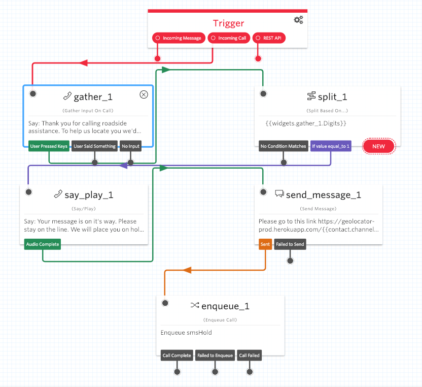

# Twilio Live Call Geolocation

Sometimes in a contact centre an agent needs to know exactly where in the world a person is. This is often not an easy task, especially if the person calling is in an emergency situation. What if you could send them an SMS while they're on the call and display their precise location to the agent who answers their call?

Twilio provides all the building blocks to handle this omni-channel interaction and the ability to route the caller and present the information to the agent.

## Technologies
1. Twilio Studio
2. Twilio Sync
3. Twilio Voice and SMS
4. Twilio Flex
5. Server side application using Flask, Twilio REST APIs and Google Maps API
6. Front end for caller to publish location using Javascript, Google Maps API, Twilio Sync SDK

## Call Flow
1. Caller dials a Twilio number and is directed to a Studio flow
2. Caller accepts being sent an SMS and is placed in a queue
3. Caller stays on the phone, taps the link in the SMS
4. Caller confirms location through mobile browser
5. Location is written to a Twilio Sync document identifiable by the caller's phone number
6. A task is created with the callers latitude and longitude; the caller is enqueued to Twilio Flex
7. Agent accepts the task and is connected to the caller
8. Flex plugin replaces the CRM container with a Google Maps view showing the callers location


## Setup
### Step 1: Provision a Twilio Flex Instance
Follow the instructions here to get up and going https://www.twilio.com/docs/flex/flex-onboarding-instructions

### Step 2: Configure IVR in Studio
Head to https://www.twilio.com/console/studio/dashboard. Create a new flow. You can either create your own from scratch, or use [Studio Flow JSON](studioFlow.json) and paste in the contents using Import from JSON in the template options. Change the configuration of your Flex number to direct to this new flow, or purchase a new number. You could also modify the default Flex flow.



### Step 3: Deploy Server Side Application
[](https://heroku.com/deploy)

Once deployed, note the URL Heroku creates for you. You can either go to your Heroku Dashboard and add ```SERVICE_BASE_URL``` with your Heroku URL or from CLI ```heroku config:set SERVICE_BASE_URL="<YOUR_HEROKU_URL>"```

### Step 4: Create a Flex Plugin
Follow the instructions here: https://www.twilio.com/docs/flex/tutorials/building-flex-plugins

When you reach the part about adding the Bing URL, add this instead:

```javascript
flex.CRMContainer.defaultProps.uriCallback = (task) => {
  return task ? `https://www.google.com/maps/embed/v1/place?key=<YOUR_GOOGLE_API_KEY>&q=${task.attributes.lat},${task.attributes.lng}&zoom=17` : "https://bing.com/";
}
```

Follow the rest of the instructions to test and deploy your plugin


